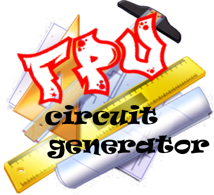
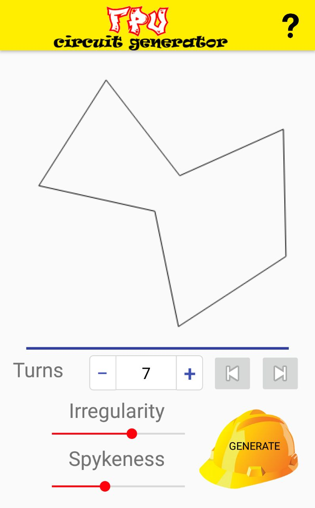

 

The aim of this App is to create a random shape that can be used as a start when setting up an fpv circuit

# How to install

You can install the app in two following ways:

- Download and install the apk from github.com
- Download the repo and compile the project on your own IDE
	
## Download and install the apk form github.com

You have to:

- Download the apk file (located in the folder Releases) 
- Transfer the file into your Android smartphone
- Using your file manager go to where you put the file and launch the installation
	
Remaind that to install apk outside the Play Store you have to enable the option **Unknown Sources** normally located under **Menu>Settings>Security** 

## Download the repo and compile the project on your own IDE
You can follow two method:
- Directly install using **Run**
- Generate the apk 
### Directly install using Run
- Import the project
- Once the project is imported and built by gradle if the **Run** button (in the run menu or among the buttons on top) is not available it means that the app dependencies are not specified. To correct this situation, press on the menu on the left of the **Run** button or press the **Edit configuration** in the run menu and create a new configuration with **App** as the module. 
- Once the configuration is set (or if it was already set) press the **Run** button and either select a connected device with ADB and Debug permission set up.
- Wait for the application to build and at the end the program will be installed and ready to use on the selected device.

### Generate the apk
- Import the project
- Once the project is imported and built by gradle click the dropdown menu near Run button in the toolbar at the top
- Select **Edit Configurations**
- Click the **+**
- Select **Gradle**
- Choose your module as **Gradle project**
- In Tasks: enter **assemble**
- Press **Run**
- Wait for the application to build and at the end the program will be installed and ready to use on the selected device.

Your unsigned apk is now located in

	FpvCircuitGenerator\app\build\outputs\apk
	
# How to use Fpv Circuit Generator

Select the number of turns wanted and play with spykeness and irregularity parameters(spykeness express narrow turns density and irregularity express how much segments length has to be irregular). Then click generate. To see old circuit generated please use left and right button located above the **Generate** button. Remember that this app simply gives you an idea on the shape of the circuit. 
